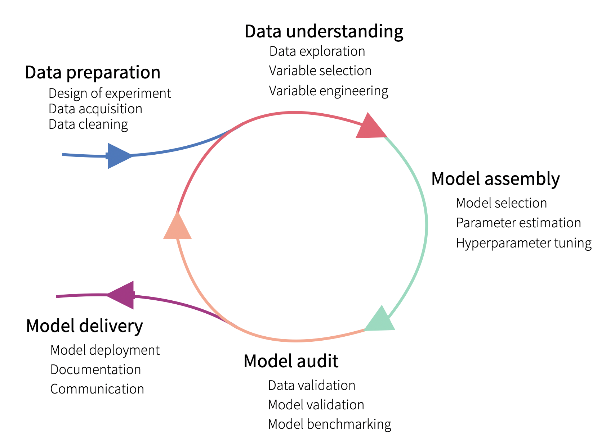

# Exploratory Model Analysis

A brief overview of how to use Exploratory Model Analysis.

## Purpose

Exploratory Model Analysis (EMA) in the realm of data science refers to the process of examining and evaluating the performance of a machine learning or statistical model. The goal of EMA is to gain insights into how well a model is performing, understand its strengths and weaknesses, and identify areas for improvement. This analysis is typically conducted before deploying the model to make informed decisions about its usefulness and potential impact.

Key aspects of Exploratory Model Analysis include:

1. **Model Evaluation Metrics**: Assessing the performance of a model using relevant metrics such as accuracy, precision, recall, F1 score, area under the curve receiver operating characteristic (AUC-ROC), etc. The choice of metrics depends on the nature of the problem (classification, regression, etc.) and the specific goals of the analysis.
2. **Visualization**: Creating visualizations to understand the distribution of predicted values, compare them with actual values, and identify patterns or trends. Visualization tools can help in spotting issues like overfitting, underfitting, or biases in the model predictions.
3. **Error Analysis**: Examining instances where the model makes errors and trying to understand the reasons behind them. This involves looking at misclassified samples and understanding if there are patterns or commonalities that the model is struggling with.
4. **Sensitivity Analysis**: Evaluating the model's sensitivity to changes in input features or parameters. This helps in understanding which features or parameters have a significant impact on the model's predictions and can guide feature selection or hyperparameter tuning.
5. **Model Robustness**: Testing the model's performance under different conditions, such as variations in input data, changes in the distribution of data, or the introduction of noise. Robust models are less likely to fail in real-world scenarios.
6. **Interpretability**: Exploring the interpretability of the model, especially for complex models like deep neural networks. Understanding how the model makes decisions is crucial for gaining trust and acceptance in various applications.
7. **Model Comparison**: Comparing the performance of multiple models or different versions of the same model to select the most suitable one for the specific task.

Exploratory Model Analysis is an iterative process, and the findings may lead to refining the model, collecting additional data, or making changes to the feature engineering process. It plays a crucial role in the model development lifecycle, helping data scientists and stakeholders make informed decisions about the deployment and use of machine learning models.

## Types of EMA

1. **Instance-level explainers** help to understand how does a model yield a prediction for a single observation (instance).
   1. **Example:** We may discover that the model is providing incorrect predictions, and we may want to find the reason. For instance, a patient with a very low risk-score experienced a heart attack. What has driven the wrong prediction?
2. **Dataset-level explainers** help to understand how do the model predictions perform overall.
   1. **Example:** We may want to learn which variables are “important” in the model. For instance, we may be interested in predicting the risk of heart attack by using explanatory variables that are derived from the results of medical examinations. If some of the variables do not influence predictions, we could simplify the model by removing the variables.

## Process

## Resources

- [exploratory-model-analysis](https://ema.drwhy.ai/)
- [pycaret](https://pycaret.org/)
- [dalex](https://dalex.drwhy.ai/python/)
- [iml-learning](https://gitlab.com/ramsey-solutions/analytics/iml-learning)
